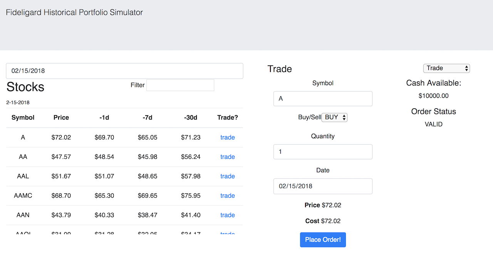

# Fideligard

A single page app, using over 2,400 US publicly traded stocks to simulate buying and selling stocks from different days. As well as showing pricing history and all transactions done on the simulated portfolio.



## Getting Started

### Prerequisites

All you need is `npm` and a `www.quandl.com` api key to get up and running.

### Installing - Server

Install modules

```
npm install
```

Create the .env in the root directory (this will hold your api key)

```
touch .env
```

In the .env file add

```
FIDELIGARD_API_KEY=123123
```

then run the server

```
npm start
```

### Installing - Client

Change to client directory

```
cd client/
```

Install modules

```
npm install
```

Next is to edit the fetch url in `src/actions/GetterActions.js` to your server eg. `http://ip-address:port#/WIKI/...`

Then run the react development server

```
npm start
```

## Built With

* [React](https://reactjs.org/docs) - The front facing web framework used
* [Express](https://expressjs.com/) - The server side framework used

## Author

* **Chuck Michael** - _Initial work_ - [chuckinabox](https://github.com/chuckinabox)

## License

This project is licensed under the MIT License - see the [LICENSE](LICENSE) file for details
